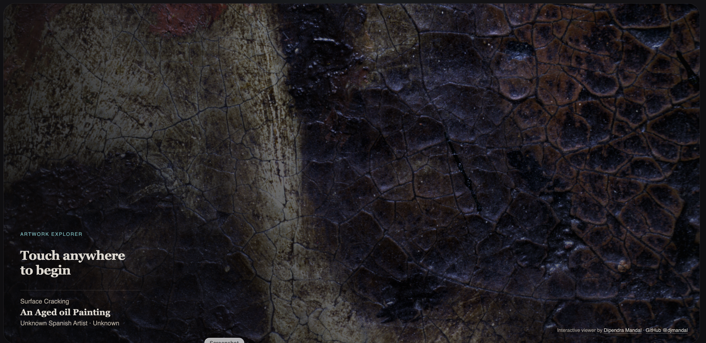

# Cultural Heritage Touch Visualization

A touchscreen viewer and Admin application for cultural-heritage imaging, with a FastAPI backend and IIIF high-resolution viewing.

## Screenshots

### Kiosk standby screen


### Multi-view comparison


### Admin dashboard


## Requirements

- macOS or Linux with Bash
- Python 3.10+
- Node.js 20.19+ or 22.12+
- Java 17+
- `curl` and `unzip` for the first-time Cantaloupe download

## Install and run

For setup instructions, Admin uploads, kiosk use, folder layout, and troubleshooting, see the [User Guide](USER_GUIDE.md).

From the project root, install the Python and JavaScript dependencies and download Cantaloupe:

```sh
bash scripts/setup.sh
```

Then start the backend, Admin, kiosk, and Cantaloupe IIIF server together:

```sh
bash scripts/dev.sh
```

On first launch, the development script creates `backend/.env` with a random Admin password, saves it locally, and prints it once. Keep the password somewhere safe. The Admin app requires this password to upload, regenerate, or delete datasets; the kiosk remains public. `backend/.env` is ignored by Git. For HTTPS deployments, set `TOUCHVIZ_ADMIN_COOKIE_SECURE=true` and `TOUCHVIZ_ENV=production` in the backend environment.

The launcher prints both localhost and detected LAN URLs for the kiosk, Admin, backend, and IIIF server. Use the kiosk LAN URL on a touchscreen connected to the same network. All services share one terminal; press Ctrl-C to stop them together.

`CANTALOUPE_JAR` can point to an existing Cantaloupe JAR to avoid downloading it again. Setup downloads the official Cantaloupe 5.0.7 distribution into the ignored `.local/` directory; the binary and uploaded datasets are not committed to GitHub. Cantaloupe is distributed under the University of Illinois/NCSA Open Source License. Preserve its third-party notices when redistributing it.

More IIIF details and external-host configuration are in [backend/iiif/IIIF_SETUP.md](backend/iiif/IIIF_SETUP.md).

## Data storage

- Uploaded source files are kept under `backend/data/raw/`.
- Generated previews, band images, and RGB masters are kept under `backend/data/derived/`.
- Cantaloupe's on-demand IIIF derivatives are cached under `backend/data/iiif-cache/`.

These data directories are ignored by Git except for their `.gitkeep` files. Back them up separately for a real collection.

## Credits

Created by [Dipendra Mandal](https://www.ntnu.no/ansatte/dipendra.mandal) · [GitHub](https://github.com/djmandal).

## License and citation

This repository is available for non-commercial academic or scientific research and education under the [Research Use License](LICENSE). Commercial use, including commercial research, requires separate written permission. If you use the software in research, cite the project using GitHub's **Cite this repository** link or the details in [CITATION.cff](CITATION.cff).
