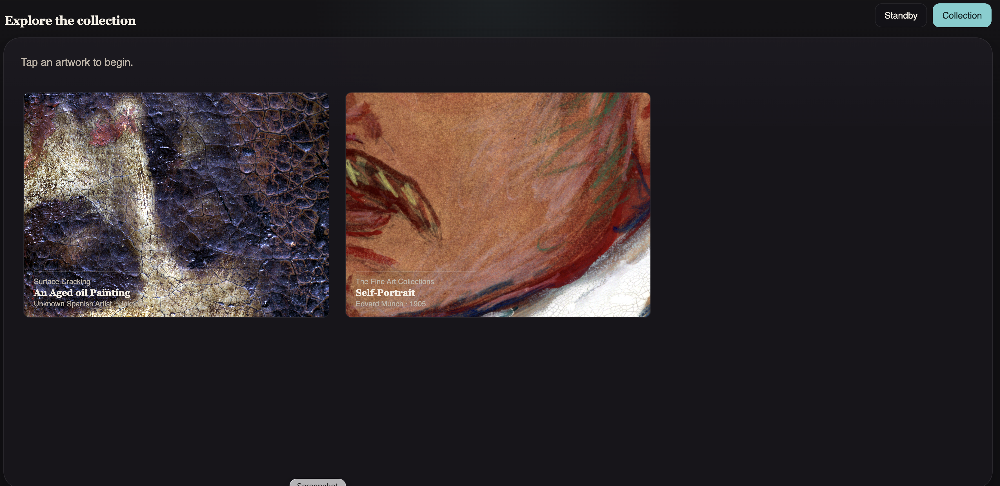
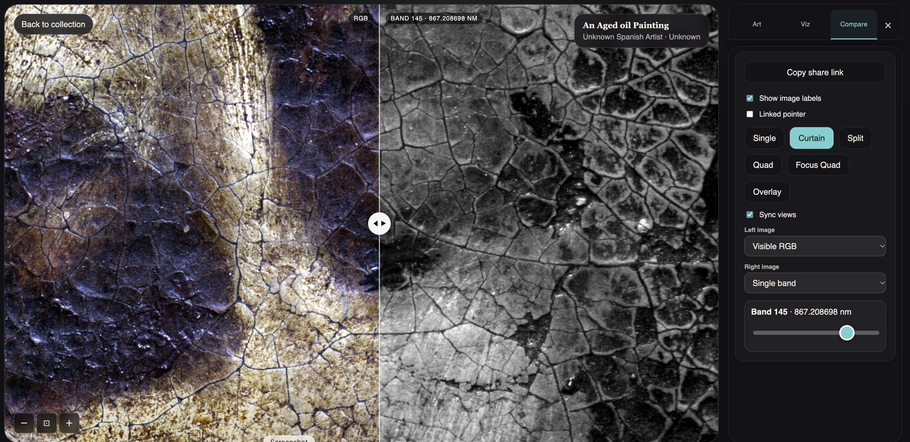
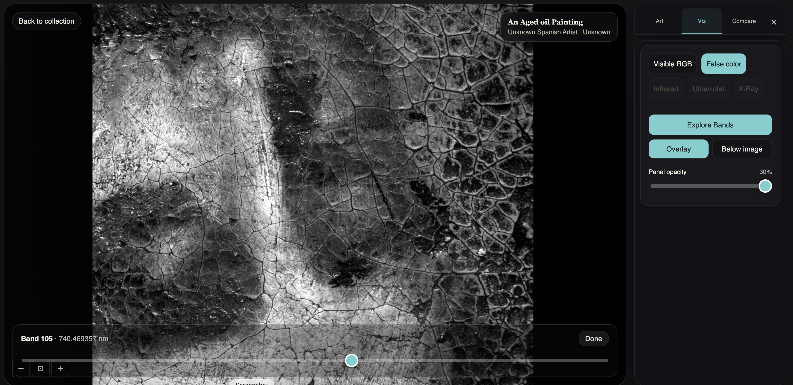
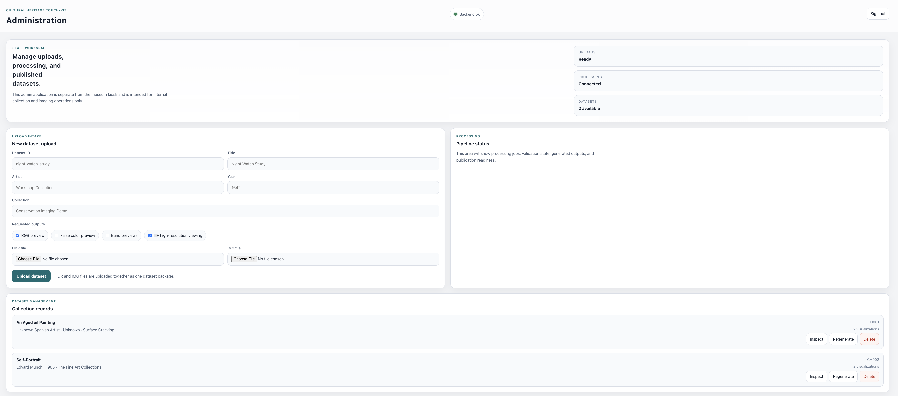
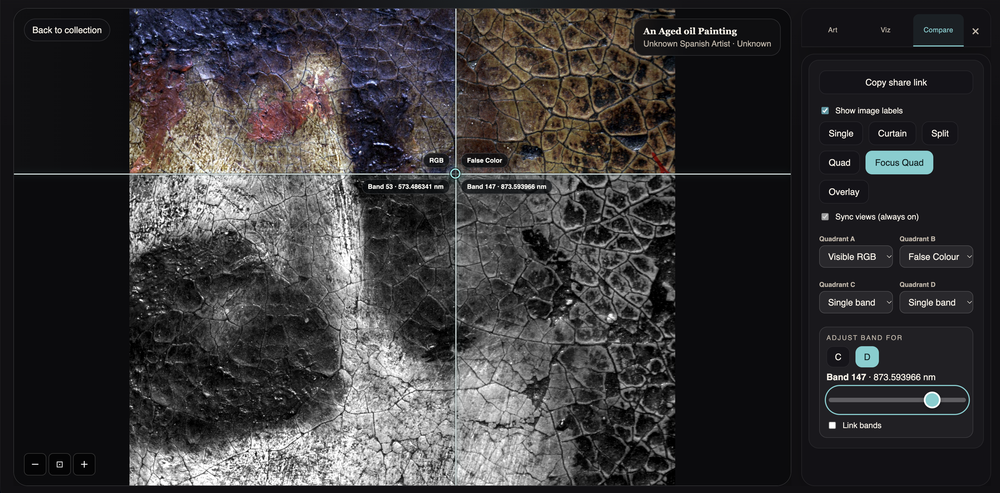

# User Guide

## What this project does

Cultural Heritage Touch Visualization is a local touchscreen system for exploring cultural heritage images, including hyperspectral imaging data. It has three main parts:

- **Kiosk:** the public-facing collection and image viewer.
- **Admin:** an internal interface for uploading, processing, regenerating, and removing datasets.
- **Backend:** a FastAPI service that stores dataset files, creates viewing images, and provides dataset information to the other two apps.

The system can create RGB and false-colour previews, individual band images, and IIIF Image API endpoints for high-resolution zooming. Which views are available depends on the outputs generated for each dataset.

## Interface overview

### Kiosk collection


### Compare mode


### Band exploration


### Admin workspace


## Requirements

- macOS or Linux with Bash
- Python 3.10 or newer
- Node.js 20.19+ or 22.12+ with npm
- Java 17 or newer (used by the IIIF server)
- Internet access during first-time setup to download project dependencies and Cantaloupe

## Install and start

Open a terminal in the project folder. Install dependencies once:

```sh
bash scripts/setup.sh
```

Start the backend, Admin app, kiosk, and IIIF server together:

```sh
bash scripts/dev.sh
```

The script prints local addresses and, when it can detect one, LAN addresses. Use the kiosk LAN address on a touchscreen on the same network. Keep the terminal open while using the system; press **Ctrl+C** there to stop all services.

On its first launch, `scripts/dev.sh` creates `backend/.env` with a random Admin password and prints it once. Save that password securely. If `backend/.env` already exists, the script uses its `TOUCHVIZ_ADMIN_PASSWORD` value. This file is ignored by Git. Admin sessions expire after eight hours; sign out when finished. Login is rate-limited after repeated failures, and upload size is capped at 8 GiB by default; adjust `TOUCHVIZ_MAX_UPLOAD_BYTES` in `backend/.env` if your paired files need a different limit.

Default local addresses:

| Service | Address |
| --- | --- |
| Kiosk | <http://localhost:5173> |
| Admin | <http://localhost:5174> |
| Backend API | <http://localhost:8000> |
| Backend API docs | <http://localhost:8000/docs> |
| IIIF image service | <http://localhost:8182> |

The launcher expects the setup script's dependencies to be installed. To use an existing Cantaloupe JAR instead of the downloaded copy, set `CANTALOUPE_JAR` to its path before starting `scripts/dev.sh`.

## Upload a dataset in Admin

1. Open the Admin address printed by `scripts/dev.sh` (normally <http://localhost:5174>).
2. In **New dataset upload**, enter a unique Dataset ID, title, artist, year, and collection. Use a simple ID such as `painting-study-01`; it becomes the dataset's folder name.
3. Select the outputs you need:
   - **RGB preview** creates the visible-light image used as the main preview.
   - **False color preview** creates a false-colour visualization.
   - **Band previews** creates the single-band images and band slider data.
   - **IIIF high-resolution viewing** makes the RGB master available through Cantaloupe for deep zoom.
4. Choose the matching `.hdr` and `.img` files from the same ENVI dataset. The header describes the binary image, so upload the corresponding pair.
5. Select **Upload dataset** and wait for the result message. Large files may take time to transfer and process.

The backend saves the original files before processing. If processing succeeds, the dataset appears in the Admin dataset list and the kiosk collection. The available visualizations shown by the kiosk depend on generated outputs.


### Managing existing datasets

Admin requires the password shown on the first `scripts/dev.sh` launch. The backend stores only a short-lived, HTTP-only session cookie in the browser; the password is not embedded in the frontend. To change it, edit `TOUCHVIZ_ADMIN_PASSWORD` in the ignored `backend/.env` file and restart the services. Use a unique password of at least 16 characters.

- **View details** shows dataset metadata, processing status, generated visualizations, and available files.
- **Regenerate** reruns generation for an existing dataset from its saved source files.
- **Delete** removes that dataset's original files and generated files. The built-in demo dataset is protected from deletion.

## Use the kiosk

1. Open the kiosk address. On a new session, touch or click to begin.
2. Choose an artwork from **Explore the collection**.
3. Use the viewer controls to zoom in, reset the view, or zoom out. Drag or swipe to pan around a zoomed image. The mouse wheel or trackpad scroll can also zoom.


4. Open **Tools** to reveal the Art, Viz, and Compare tabs.

### Art and Viz tools

- **Art** contains artwork information and related details.
- **Viz** lets you choose an available visualization, such as Visible RGB, False Colour, Infrared, UV, X-Ray, or Explore Bands. Unavailable views are not offered for that dataset.
- **Explore Bands** opens the band slider when single-band images were generated. The slider shows the selected band and wavelength; move it by touch or mouse. Band images can be zoomed and panned with the viewer controls.


### Compare tools

Choose a compare layout, then choose which visualization or band to show in each image area. Available layouts include Single, Curtain, Split, Quad, Focus Quad, and Overlay.

- **Curtain** reveals one image on each side of a movable divider.
- **Split** shows two images in separate areas.
- **Quad** shows four images in four fixed areas.
- **Focus Quad** shows four selected sources through a movable focus point while keeping their image views aligned.
- **Overlay** layers two sources and provides an opacity control.
- **Sync views** links navigation between compare views where available.
- **Linked pointer** shows the pointer position across the compare views.
- **Display labels** toggles the labels on compare images.

Compare sources can include single-band images when the dataset has band previews. Select the pane to adjust where the band applies, then choose a band from the band controls.




## Where files are stored

```text
project/
├── apps/
│   ├── admin/                 Admin application source
│   └── kiosk/
│       ├── public/collection/ Bundled demo artwork images
│       └── src/               Kiosk application source
├── backend/
│   ├── app/                   API, processing, and manifest code
│   ├── data/
│   │   ├── raw/<dataset-id>/  Original uploaded HDR/IMG files
│   │   ├── derived/<id>/      Generated previews, bands, manifests, RGB masters
│   │   └── iiif-cache/        Cantaloupe's regenerable image-response cache
│   └── iiif/                  Cantaloupe configuration and setup notes
├── scripts/
│   ├── setup.sh               Installs dependencies and Cantaloupe
│   └── dev.sh                 Starts all four local services
└── USER_GUIDE.md              This guide
```

`backend/data/raw/<dataset-id>/` contains the uploaded originals. `backend/data/derived/<dataset-id>/` contains the files used by the kiosk and IIIF service, including the dataset's `manifest.json`. The directories are ignored by Git so large artwork data is not accidentally committed. **Back up `backend/data/raw` and `backend/data/derived` separately**; the IIIF cache can be recreated.

The images in `apps/kiosk/public/collection/` are the bundled demo collection assets. They are separate from datasets uploaded through Admin. Vite copies this public folder into the kiosk's build output when building the kiosk.

## Sharing the kiosk on a local network

Run `scripts/dev.sh` on the computer hosting the services. Use the printed kiosk LAN address from a touchscreen connected to the same network. Keep the backend and IIIF service reachable from that device; the frontend obtains dataset information from the backend and high-resolution tiles from IIIF.

For a public or production deployment, configure HTTPS, set `TOUCHVIZ_ENV=production` and `TOUCHVIZ_ADMIN_COOKIE_SECURE=true`, provide persistent storage for raw and derived data, and configure the IIIF host URL for the kiosk. If Admin is hosted on a separate origin, add it to `TOUCHVIZ_ADMIN_ORIGINS` and the corresponding CORS configuration. Put an upload-body size limit at the reverse proxy as well, since multipart request parsing happens before the application writes uploaded files. The in-memory Admin sessions are intended for the single-process development server; use a shared session store if deploying multiple backend workers. See [backend/iiif/IIIF_SETUP.md](backend/iiif/IIIF_SETUP.md) for IIIF host configuration notes. Do not use the development launcher as a production deployment setup.

## Troubleshooting

- **A service does not start:** check that setup completed and that Python, Node.js, and Java meet the requirements. Stop any other process already using ports 5173, 5174, 8000, or 8182.
- **Admin says the backend is offline:** confirm the backend is running on port 8000 and reload Admin.
- **An uploaded dataset does not appear in the kiosk:** check its Admin processing status and requested outputs. Refresh the kiosk after processing completes.
- **Band controls or visualizations are missing:** regenerate or re-upload with **Band previews** or the needed visualization output selected.
- **IIIF deep zoom is unavailable:** confirm **IIIF high-resolution viewing** was requested for that dataset and that Cantaloupe is running. Dataset IIIF information is served from a URL shaped like `http://localhost:8182/iiif/3/<encoded-dataset-id%2Fmaster%2Frgb-master.png>/info.json`.

## Credits

Created by [Dipendra Mandal](https://www.ntnu.no/ansatte/dipendra.mandal). Source code: [GitHub](https://github.com/djmandal).
